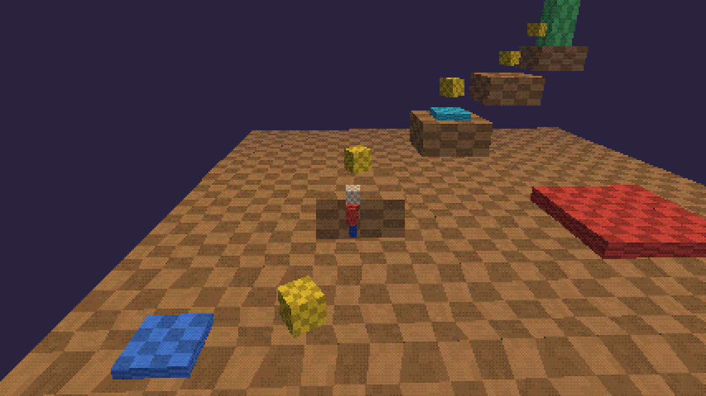

# StackS



A two-part stack for a PS1-style 3D platformer:

- **Runtime (C#)**: deterministic simulation kernel and command bus in `src/StackS.Kernel`.
  Compiled to WebAssembly for the in-browser editor (`src/StackS.Web`) and to native code with
  NativeAOT for the shipped game (`src/StackS.Cli` is the first native host: headless replays).
- **Tools (JavaScript)**: a browser level editor (`editor/`) that embeds the runtime and talks to it
  only through the command bus, plus a dependency-free dev server (`devserver/serve.mjs`) that saves
  levels and replays into `content/` (commit that folder: it is the source of truth).

The web build is a development tool only. The game ships natively on Windows, macOS, Android and iOS.

## Status

| Piece | State |
| --- | --- |
| Kernel: model, versioned JSON, simulation, command bus with undo/merge, replays | Built; 14 tests pass |
| Determinism: C# and the JS reference sim give bit-identical end states on all golden replays | Verified |
| Browser editor (parts, play/stop, live tuning, undo, console, replay check, autosave, golden export) | Works on the JS runtime; switches to C# when the WASM bundle exists |
| WebAssembly host (`src/StackS.Web`) | Compile-checked; **not yet built for browser-wasm** |
| Native platform layer (`native/`, Sokol, PS1 renderer, shaders for GL/GLES3/D3D11/Metal) | Built and run on Linux (GL 4.1); screenshot in `docs/images` |
| Desktop game (`src/StackS.Desktop`) | Built and run on Linux: renders the level, replays golden runs to the identical end state, records runs that verify in C# and JS |
| Windows (D3D11) and macOS (Metal) desktop builds | Code complete; not built yet |
| NativeAOT publishes (CLI, desktop) | Not run yet (needs NuGet access) |
| Android host (NativeActivity + NativeAOT `.so`) | Scaffolded (`android/`, `scripts/build-android.sh`); **untested** |
| iOS host (Xcode via CMake + NativeAOT `.a`) | Scaffolded (`ios/`, `scripts/build-ios.sh`); **untested** |

## CI and the hosted editor

Every push runs `.github/workflows/ci.yml`: kernel tests, JS golden replays, a NativeAOT Linux CLI
that verifies the goldens, the WebAssembly build, and the Linux desktop smoke test. Pushes to `main`
also deploy the browser editor (with the C# runtime) to GitHub Pages; there is no dev server, so
levels and runs save only in the browser (autosave, export). Windows, macOS and Android builds live
in `.github/workflows/platforms.yml` and run only when started by hand.

## Prerequisites

- .NET 8 SDK (or newer; .NET 9+ is needed later for NativeAOT on iOS)
- Node.js 18+
- For the WebAssembly build: `dotnet workload install wasm-tools`
- For NativeAOT: the platform C toolchain (Visual Studio "Desktop development with C++" on Windows,
  Xcode command line tools on macOS, `clang` and `zlib1g-dev` on Linux)

## Quick start

```bash
# 1. Kernel tests (includes the cross-language golden replays)
dotnet run --project tests/StackS.Tests -c Release

# 2. Build the C# runtime for the browser
dotnet workload install wasm-tools
dotnet publish src/StackS.Web -c Release -o build/web

# 3. Start the editor
node devserver/serve.mjs
#    open http://localhost:5173  -> the badge in the header should read "Runtime: C# (.NET WebAssembly)"
#    add ?runtime=js to the URL to compare with the JS reference runtime

# 4. Native host with NativeAOT (pick your RID: win-x64, osx-arm64, linux-x64)
dotnet publish src/StackS.Cli -c Release -r win-x64 -p:PublishAot=true -o build/cli
build/cli/stacks verify content/replays
build/cli/stacks bench
```

### Native game

```bash
scripts/build-desktop.sh            # Linux/macOS (JIT); add "aot" for a NativeAOT executable
.\scripts\build-desktop.ps1         # Windows
build/desktop-jit/stacks-game       # WASD/arrows, Space, P = PS1 on/off, R = restart, Esc = quit
build/desktop-jit/stacks-game --replay content/replays/route-default.replay.json
build/desktop-jit/stacks-game --record my-run.replay.json   # then: stacks verify my-run.replay.json

scripts/build-android.sh            # APK + install (Android SDK/NDK 26, Gradle)
scripts/build-ios.sh                # Xcode project in build/ios (macOS, Xcode, .NET 9+)
```

### Feasibility checklist (do these in order)

- [ ] Step 1 prints `14 passed, 0 failed` (or more, if you added goldens).
- [ ] Step 3 shows the C# badge; play the level with Tab, stop, click **Verify last run**: it says `Match. [csharp]`.
- [ ] Click **Save run as golden test**, then run step 1 again: the new replay is checked by C# too.
- [ ] Step 4 prints `all N replays match` from a NativeAOT binary.

If all four pass, the core claim of StackS holds: one C# runtime drives the browser editor and native
builds, with bit-identical behaviour proven by replays.

## How it fits together

```
editor/ (browser)                          src/StackS.Web (WASM)        src/StackS.Kernel
  index.html, editor.js  -- exec(name,args) -->  Bridge.Exec  ----------->  Runtime (command bus)
  PS1 renderer (three.js) <-- view() JSON -----  Bridge.View                 Sim (deterministic)
  runtime-js.js (fallback, same contract)                                    LevelSerializer (versioned)
devserver/serve.mjs  <-> content/levels, content/replays
src/StackS.Cli (native, NativeAOT) -> stacks verify content/replays
```

Command bus contract (both runtimes): `part.add`, `part.set`, `part.move`, `part.remove`, `tune.set`,
`doc.load`, `doc.get`, `part.get`, `undo`, `redo`, `play`, `stop`, `tick`, `replay.verify`, `replay.export`.
Results are `{ok, res | err, docVersion, mode}`.

## Golden replays

A replay file holds the level snapshot it started from, every input bit per tick, every live tuning
change, and the exact expected end state (IEEE bits of position and velocity, coins, deaths, tick).
Save one from the editor, or regenerate the built-in ones with `node tools/make-golden.mjs`.
Both `tests/StackS.Tests` (C#) and `node tools/check-js-goldens.mjs` (JS) must reproduce every one.
If a change to `Sim.cs` is intentional, change `editor/sim.js` identically and regenerate.

## Next steps

1. Run the feasibility checklist, then the desktop build on your OS (Windows D3D11 / macOS Metal).
2. Android: `scripts/build-android.sh`. Expect to adjust NativeAOT flags; see the system guide.
3. iOS: `scripts/build-ios.sh`, then sign and run from Xcode.
4. Text HUD (sokol_debugtext), touch-control overlay, audio (sokol_audio).
5. Live tuning from the browser editor to a phone over WebSocket, using the same command bus.

See `AGENTS.md` for the rules agents must follow, and `docs/adr/` for the decisions behind them.

## Troubleshooting

- **Badge says JavaScript reference**: the dev server did not find `_framework/dotnet.js`. Check the
  publish output folder; `devserver/serve.mjs` lists the folders it searches (`BUNDLE_CANDIDATES`).
- **`IsAotCompatible` restore error offline**: the AOT analyzers download a package; build once online.
- **Replay mismatch**: something non-deterministic entered `Sim.cs` (clock, random, `Math.Sin`, dictionary
  iteration order, float↔int conversion differences). Bisect with `stacks verify` on the failing replay.
